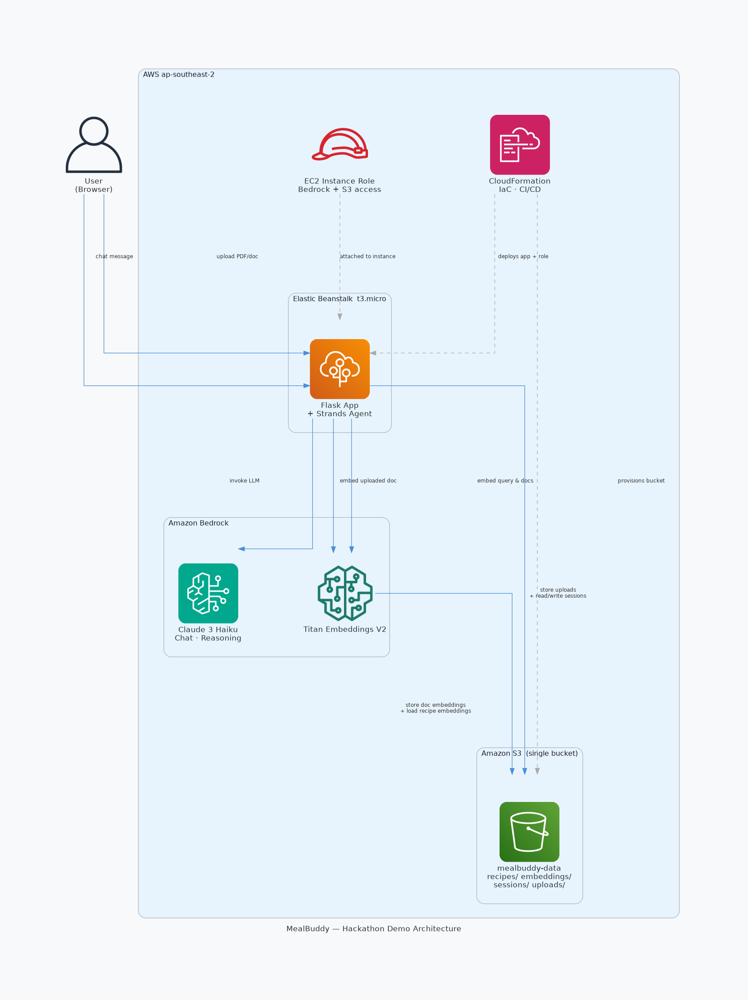
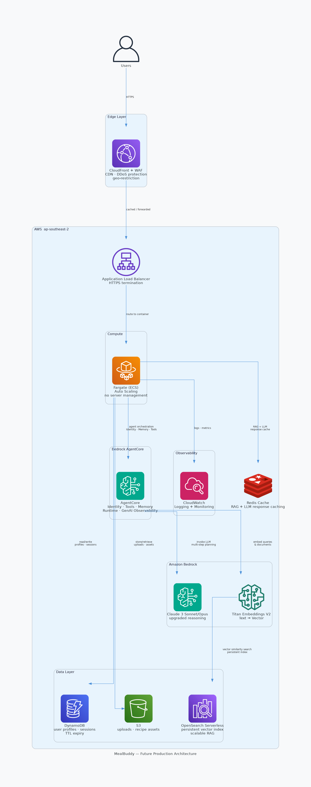

# 🍳 MealBuddy - Your Personalised AI Nutrition Buddy, Powered by Multi-Agent Intelligence

> **ANZ Diversity Hackathon 2026 - Team 54 - MealBuddy**

> **Team Members:**
> - Alice Nguyen – alice.nhnt@gmail.com
> - Evelyn Le – evelyn.le.contact@gmail.com

---

## 1. Use Case

### 1.1 Problem Definition

**The Crisis:**

Chronic disease driven by poor diet is one of the most preventable crises of our time. According to the World Health Organization, unhealthy diets contribute to **11 million deaths globally each year**, making it the single largest risk factor for disease burden worldwide *(GBD Diet Collaborators, The Lancet, 2019)*. In Australia, **66% of adults are overweight or obese**, with poor nutrition cited as a primary driver *(AIHW, 2024)* – and only **4% of Australian adults** meet the recommended daily vegetable intake *(AIHW, 2024)*. Poor diet costs the Australian healthcare system an estimated **$6 billion per year** in direct costs *(AIHW, Australian Burden of Disease Study, 2022)*.

**The Real Problem – Cognitive Burden, Not Motivation:**

Research consistently shows that **most people who begin a healthy eating plan struggle to sustain it long-term** – not from lack of motivation, but from the cognitive and logistical burden of maintaining it *(Teixeira et al., IJBNPA, 2015)*:

- Meal planning takes **2–3 hours per week**
- A dietitian costs **~$200 AUD per session** with long wait times *(Vively, 2024)*
- Calorie tracking apps require **exhausting manual entry** for every meal
- Existing tools are **fragmented, generic, and reactive**

People don't need another tracking app – they need an intelligent partner that plans proactively and removes friction.

### 1.2 MealBuddy – The Solution 
**Our Vision:**

MealBuddy addresses the gap of **fragmented, generic, and inaccessible nutrition tools** by delivering **personalised, proactive nutrition support** through a **single AI-powered conversation**. 

**Core Innovation – Multi-Agent Intelligence:**

MealBuddy is a conversational AI nutrition assistant combining:

- **Multi-agent architecture**: Coordinator agent routes to specialist agents for focused, reliable responses in planning meals, suggesting recipes, creating shopping lists, and personalising content based on user profile
- **Document RAG**: Upload personal nutrition or health notes – MealBuddy applies context to every meal plan
- **Autonomous planning**: "Plan my week" generates 7 days of personalised meals in seconds based on user profile
- **Behavioral psychology**: Streak tracking and badges increase user long-term adherence
- **Zero-friction tracking**: Users can easily keep track of their current calories/macros, and MealBuddy can suggest how far they are from reaching their goals and recommend meals to achieve them

**Value Propositions – Measurable Impact:**

| Value Proposition | How MealBuddy Helps | Measurable Impact |
|---|---|---|
| **Time savings** | AI-powered autonomous meal planning | 2–3 hours planning and Googling → 10 minutes per week |
| **Accessibility** | 24/7 conversational AI support | 1/20th cost of dietitian ($10–15/month vs $200/session) |
| **Personalisation** | Reads and stores users' nutrition notes, allergy lists, and profiles | Every interaction contextual to users' health data for more personalisation – a big advantage over other generic chatbots |
| **Proactive meal planning** | Generates full week of meals without manual input | Reduces decision fatigue |
| **Ease of Use** | Interacts with the application using natural language | User-friendly, which could increase user engagement and adherence |

**Long-Term Social Impact that MealBuddy Targets:**

While personalised nutrition is a luxury (dietitian = $200/session, long wait times), MealBuddy aims at a future where no one struggles alone with nutrition – a future where intelligent support is always available, always personalised, always affordable.

### 1.3 Targeted Users

- **Busy professionals** who want to eat well but have no time to plan
- **Health-conscious individuals** managing dietary restrictions, allergies, or chronic conditions
- **Fitness enthusiasts** tracking macros without the friction of manual logging and getting smart recommendations on what to eat to reach their diet goals
- **Budget-conscious households** reducing food waste through smarter weekly planning

### 1.4 Market Need Analysis

**Market Opportunity:**

The scale of the problem translates directly into market opportunity:

- With **66% of Australian adults overweight or obese** and diet-related disease **costing $6 billion/year**, there is clear government and consumer urgency to act *(AIHW, 2022)*
- Personalised nutrition support is expensive for most – dietitian costs **~$200 AUD/session** *(Vively, 2024)*
- This creates a **large underserved population** willing to pay for a cheaper, always-available alternative

**Bottom-Up Market Sizing (Australia):**

- Australia has ~20.5 million adults. At 66% overweight or obese, that's ~**13.5 million adults** with a direct health incentive to improve their diet *(AIHW, 2024)* – this is the TAM
- Of these, the digitally active cohort aged 25–54 (the primary health-app demographic) represents roughly **~8 million Australians** *(ABS, 2021 Census)* – this is the SAM
- Capturing just **1–2% of SAM** in year 3 = **80,000–160,000 users** at $10–15 AUD/month = **$10–29M AUD ARR**

### 1.5 Competitive and Partnership Landscape 

**Competitive Differentiation:**

| Competitor | What They Do | Key Gap MealBuddy Fills |
|---|---|---|
| **MyFitnessPal** | Calorie & macro tracking via manual food logging | Reactive, no planning, no personalisation, no conversation |
| **Cronometer** | Detailed micronutrient tracking | Complex UI, no conversational AI, no autonomous meal planning |
| **ChatGPT / general LLMs** | Ad-hoc nutrition Q&A | No persistent user nutrition profile, no meal plan memory, no structured tracking |

**MealBuddy's Competitive Moat:**

Few existing solutions combine a persistent user nutrition profile, conversational AI that can act for them, document ingestion for personalisation, and autonomous multi-step action in a single nutrition support product. Most existing nutrition apps are reactive – users open it, input data, it shows a number. MealBuddy is designed to plan with users, not just record after them – making personalised nutrition support accessible to anyone, at the cost of a conversation.

**Future Ideas and Potential Business Partnership Opportunities:**

Meal kit services like HelloFresh and Marley Spoon are a natural integration opportunity – MealBuddy could recommend their kits when users want a no-prep option, or auto-populate a shopping list that links to their catalogue where users can buy from MealBuddy (future enhancement idea). Partnerships with grocery retailers (e.g., Woolworths, Coles) could take this further – enabling users to purchase ingredients directly from within the app, turning a meal plan into a completed grocery order in one step.

**Go-to-Market Strategy:**

- **Phase 1 (Months 1–6):** Enhance and deploy the enhanced solution ([see 2.2](#22-future-enhancement-architecture-production-roadmap)). Beta launch with 500 early adopters via health/fitness communities
- **Phase 2 (Months 6–12):** Freemium model (basic free, premium $10–15/month)
- **Phase 3 (Year 2+):** B2B partnerships with corporate wellness programs and business partners identified above

*References: [AIHW Overweight and Obesity (2024)](https://www.aihw.gov.au/reports/overweight-obesity/overweight-and-obesity/contents/overweight-and-obesity); [AIHW Food & Nutrition (2024)](https://www.aihw.gov.au/reports/food-nutrition/diet); [Vively, How Much Does It Cost to See a Dietitian in Australia (2024)](https://www.vively.com.au/post/how-much-does-it-cost-to-see-a-dietitian-in-australia); [AIHW Australian Burden of Disease Study (2022)](https://www.aihw.gov.au/reports/burden-of-disease/australian-burden-of-disease-study-2022); [GBD Diet Collaborators, The Lancet (2019)](https://www.thelancet.com/journals/lancet/article/PIIS0140-6736(19)30041-8/fulltext); [Teixeira et al., IJBNPA (2015)](https://ijbnpa.biomedcentral.com/articles/10.1186/1479-5868-12-S1-S4)*

---

## 2. Technical Architecture (Solution Viability + Creativity)

### 2.1 Hackathon Demo Architecture – Live & Deployed

**Why This Architecture:**

We chose this stack to validate the full product concept end-to-end within hackathon constraints – fast to deploy, zero infrastructure overhead, cost-optimised, yet production-ready. This demonstrates **solution viability** with a feasible path to scale. 

```
User
 │
 ▼
Flask UI (HTML/CSS/JS)
 │
 ▼
AWS Elastic Beanstalk  (t3.micro EC2)
 │
 ├──► Amazon Bedrock
 │     ├── Claude 3 Haiku          (Conversational AI + Strands Multi-Agent)
 │     └── Titan Embeddings V2     (Semantic recipe & document search)
 │
 └──► Amazon S3
       ├── embeddings/             (Pre-indexed recipe embeddings)
       ├── recipes/                (Recipe raw data)
       ├── sessions/               (User profiles, chat history, meal plans)
       └── uploads/                (User-uploaded documents + embeddings)
```

**Multi-Agent Architecture (Strands):**

```
User Message
     │
     ▼
Coordinator Agent (routes to specialist agents if needed)
     │
     ├──► 🥗 Planner Agent      → Meal planning, shopping list, add-to-favourite recipes
     ├──► 📊 Nutrition Agent    → Calorie tracking, macro stats, meal suggestions
     └──► 📄 Document Agent     → RAG over user-uploaded PDFs, dietary restrictions, goals, etc.
```

**Why Multi-Agent?**

Each specialist agent has focused tasks, significantly improving reliability compared to a single agent handling all intents. This architecture enables:

- **Transparency**: Users see which agent is working and what actions it's taking
- **Reliability**: Specialist agents have higher accuracy for domain-specific tasks
- **Scalability**: Easy to add new specialist agents (e.g., Exercise, Sleep, Mental Health, Chat-to-Order agents)
- **Trust**: Real-time agent action feedback builds user confidence

**Hackathon Architecture Diagram:**




**AWS Services Selected – Focus on Demonstrating PoC and Being Cost-Optimised for Hackathon Demo:**

| Service | What It Is Used For | Why Chosen |
|---|---|---|
| Elastic Beanstalk (t3.micro) | Web app hosting | Rapidly deploys and manages application without much infrastructure provisioning |
| Amazon S3 | Data storage | Data storage in cloud at near-zero cost at demo scale |
| Amazon Bedrock – Claude 3 Haiku | LLM + multi-agent reasoning | Fast and cost-saving Bedrock model |
| Amazon Bedrock – Titan Embeddings V2 | Semantic search | Fully managed, no GPU infra, optimises for cost and retrieval performance without sacrificing accuracy |
| Strands Agents (open source) | Multi-agent orchestration | Coordinator routes to specialist agents (Planner, Nutrition, Document) for focused, reliable responses |
| NumPy cosine similarity | RAG retrieval | Embedding search – quick, easy, and no-cost to implement |
| CloudFormation | IaC / CI-CD | Deploys entire stack (Beanstalk app, S3, IAM) in one template – reusable and faster deployment compared to ClickOps |

*Note that our knowledge base data for RAG embeddings are quite limited in the scope of this hackathon. In the future, we plan to crawl data from government and well-known nutrition sites to enrich our knowledge base.*

---

### 2.2 Future Enhancement Architecture (Production Roadmap)


The hackathon stack proves the concept. The future architecture introduces containerised scaling, secure identity boundaries, vector persistence, better state-of-the-art reasoning LLM models, and full-stack observability to support real-world concurrency, durability, and scalability.

```
Users (Web Browser)
 │
 ▼
Amazon CloudFront  (Edge CDN + WAF + DDoS Protection)
 │
 ▼
Application Load Balancer
 │
 ▼
AWS ECS Fargate (Containerised Compute, Auto Scaling)
 │
 ├──► AWS Bedrock AgentCore
 │      ├── Identity
 │      ├── Tools
 │      ├── Memory
 │      ├── Runtime
 │      └── GenAI Observability (OpenTelemetry of LLM traces and monitoring)
 │
 ├──► Amazon Bedrock
 │      ├── Claude Sonnet / Opus (Reasoning LLMs)
 │      └── Titan Embeddings V2 (Embedding)
 │
 ├──► Amazon OpenSearch Serverless  (Vector Knowledge Base)
 │
 ├──► Amazon DynamoDB  (User metadata, sessions)
 │
 ├──► Amazon S3  (Object storage & artifacts)
 │
 ├──► Redis Cache  (RAG + LLM response caching)
 │
 └──► Amazon CloudWatch (Logging + Monitoring)

Infrastructure:
 ├── AWS CloudFormation (IaC deployment)
 ├── Amazon ECR (Container registry)
 └── IAM Roles (Least-privilege access control)
```

**Future Architecture Diagram:**



| Layer | Service | What It Is Used For | Why Chosen |
|---|---|---|---|
| **Compute & Infrastructure** | ECS Fargate | Containerised compute | Horizontally auto-scaled, no server management, high concurrency |
| | CloudFormation (IaC) | CI/CD deployment | Reusable, automated stack deployment |
| | Amazon ECR + IAM Roles | Container registry + access control | Least-privilege access |
| **Intelligent Agent** | AWS Bedrock AgentCore | Agent orchestration | Identity boundaries, tool control, memory persistence, GenAI observability |
| | Claude Sonnet / Opus | LLM reasoning | Complex multi-step planning, structured outputs, advanced document analysis |
| | Titan Embeddings V2 | Semantic search & embeddings | Production-grade RAG, knowledge base ingestion |
| **Databases & Storage** | OpenSearch Serverless | Vector knowledge base | Persistent, scalable vector index for production RAG |
| | DynamoDB | User metadata & sessions | Single-digit millisecond reads, TTL-based expiry |
| | Amazon S3 | Object storage | Durable storage for uploads, assets, static content |
| | Redis Cache | Response & RAG caching | Reduces Bedrock latency and cost under load |
| **Edge, Security & Observability** | CloudFront + WAF | CDN + security | DDoS protection, rate limiting, geo-restriction |
| | CloudWatch | Logging + monitoring | Logging and monitoring across deployed AWS services |

---

## 3. Video Demo

[](https://www.youtube.com/watch?v=PLACEHOLDER)

---

## 4. Live Application Link

🌐 **[MealBuddy WebApp](http://mealbuddy.eba-wgpw3rds.ap-southeast-2.elasticbeanstalk.com/)**

---

## 5. Other Documentation

📋 [Application Features](FEATURES.md) 

🛠️ [Developer Guide](DEVELOPER-GUIDE.md)

---
*Built by MealBuddy team · Hosted on AWS · IaC deployed with Cloudformation · Powered by Amazon Bedrock, Strands Multi-Agent for GenAI solution development & Kiro for developer assistance*
